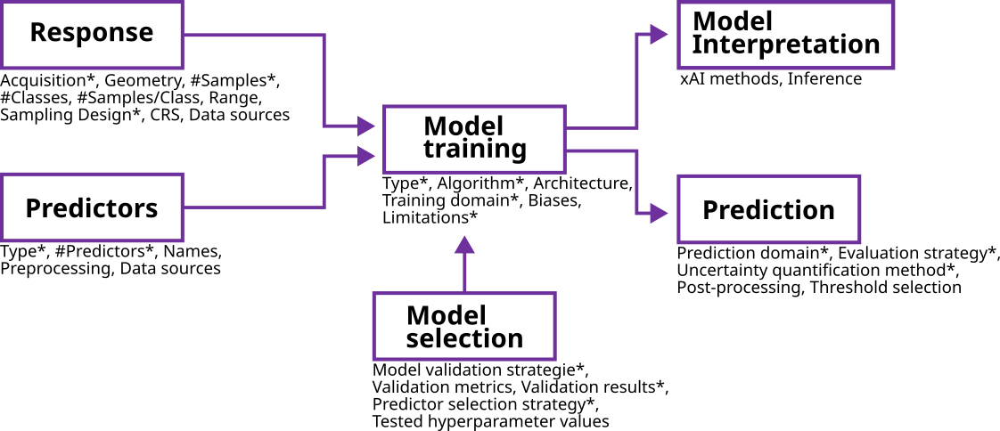

# STeMP
Machine-Learning (ML) methods -- which allow to learn complex, non-linear and often interacting relationships without the need to make assumptions about the distribution of the data -- have become increasingly popular in geoscientific spatio-temporal modelling. However, there are several pitfalls associated with the applications of ML models in general, and spatio-temporal ML models in special.

Transparently reporting important modelling decisions, as well as input data characteristics is thus key for practitioners or reviewers to understand the limitations of a model, and to evaluate if they should trust the predictions made by them. However, such transparency is often lacking in spatio-temporal ML studies in geoscientific applications. To address this, we propose the **S**patio-**Te**mporal **M**odelling **P**rotocol (STeMP). It addresses each step in a typical spatio-temporal modelling task, from the response acquisition to model training and (optional) predictions.

This [Shiny web application](https://odmap.wsl.ch/) helps to implement the ODMAP approach and produces well formatted protocols that can be exported for further usage. For further explanation please refer to the original publication [(Zurell et al., 2020)](https://onlinelibrary.wiley.com/doi/full/10.1111/ecog.04960). 

Please cite as follows:

